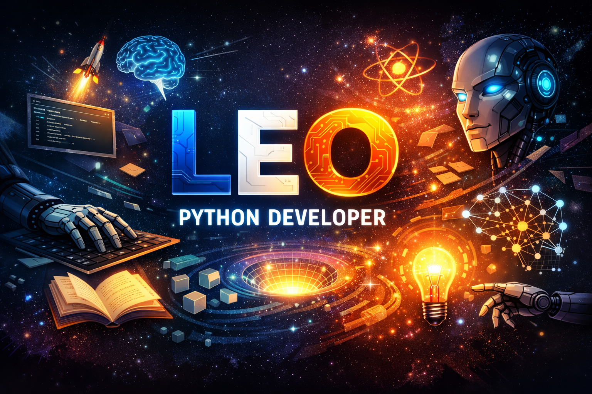
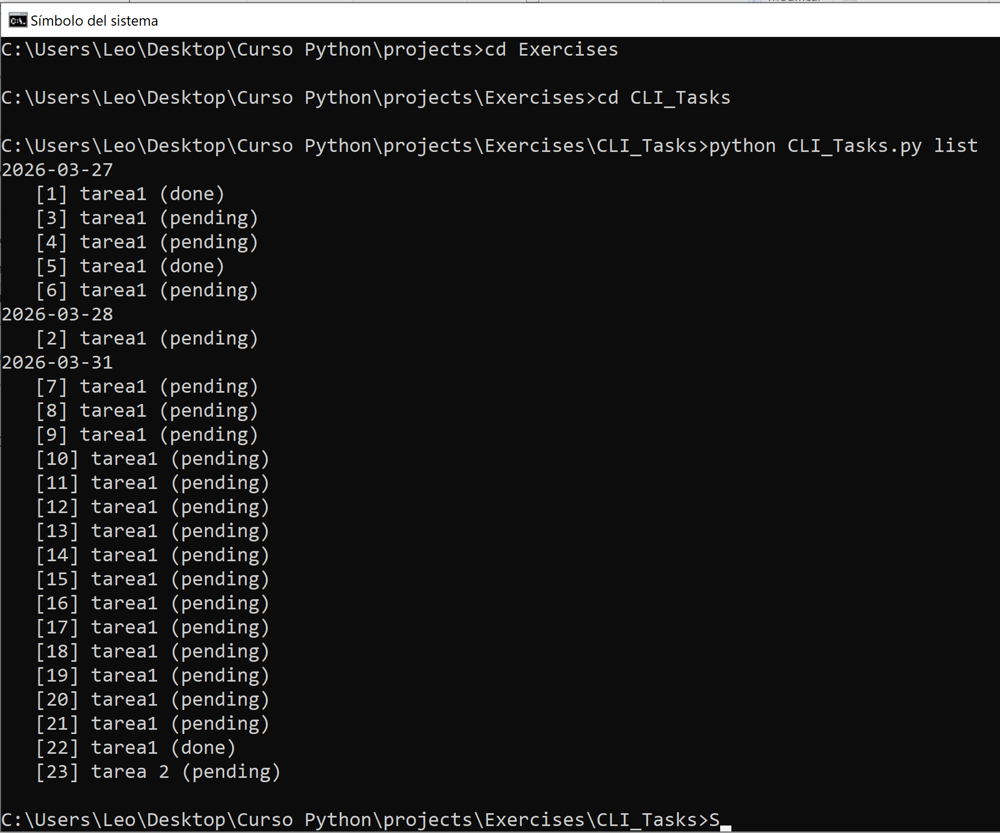

# 🦁 Hi, I'm Leo 👋

**Junior Python Developer**
## 🚀 Building, learning, and exploring Python & AI
---

I’m new to this field, but I can’t stop.

I’ve become addicted to solving problems and building useful, creative tools.

My goal is to create these tools using AI. I believe we are at the beginning of a huge shift, full of opportunities, and I’m ready to explore and build within it.

---

## 🛠️ Skills

- Python (core)
- File handling
- JSON data management
- CLI tools (`argparse`)
- Basic regex
- Data structures (lists, dictionaries)
- Debugging & problem solving

---

## 📂 Projects

### 📝 CLI Task Manager
A command-line application to manage daily tasks with persistent JSON storage.

👉 [View Project](https://github.com/Lev0130/CLI_Tasks)

---

### 📊 Log Analyzer
Analyzes log files to extract errors, count frequencies, and group by date.

👉 [View Project](https://github.com/Lev0130/Log-Analyzer)

---

### 📁 File Organizer
Automatically organizes files into folders based on their extension.

👉 [View Project](https://github.com/Lev0130/File_Organizer)

---

## 📈 Currently Learning

- Improving Python fluency
- Writing cleaner and more structured code
- Backend fundamentals
- Building more advanced CLI tools

---

## 🎯 Goals

- Transition into a junior backend role
- Build real-world, useful tools
- Strengthen problem-solving and debugging skills

---

## 📬 Contact

<!-- Replace with your links -->
- GitHub: https://github.com/Lev0130
- Email: leoshakhovcontacto@gmail.com
- LinkedIn: LINK (optional)

---

## ⚡ Notes

All projects are built as part of my learning journey, focusing on real problem-solving rather than tutorials.

<!--
**Lev0130/Lev0130** is a ✨ _special_ ✨ repository because its `README.md` (this file) appears on your GitHub profile.

Here are some ideas to get you started:

- 🔭 I’m currently working on ...
- 🌱 I’m currently learning ...
- 👯 I’m looking to collaborate on ...
- 🤔 I’m looking for help with ...
- 💬 Ask me about ...
- 📫 How to reach me: ...
- 😄 Pronouns: ...
- ⚡ Fun fact: ...
-->
